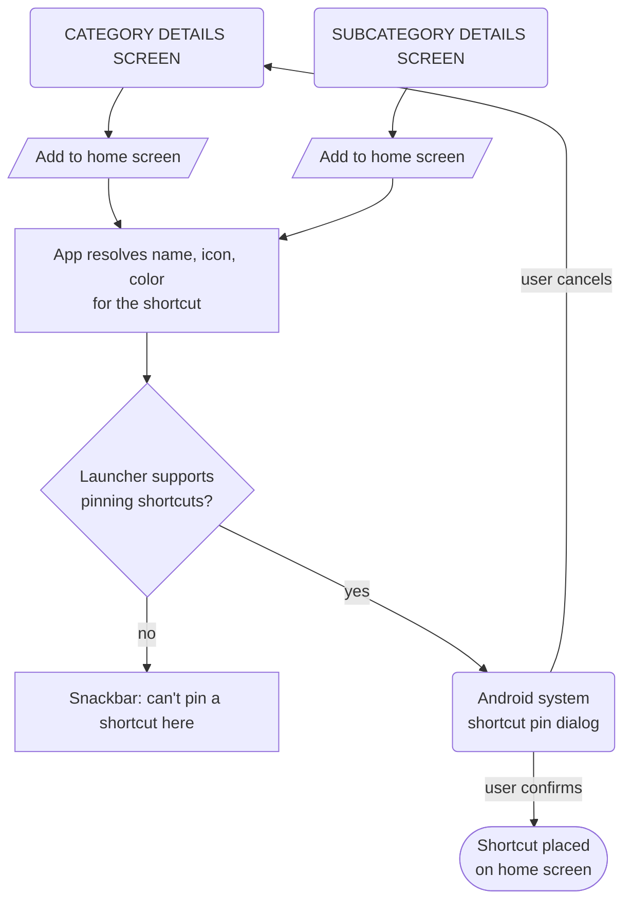
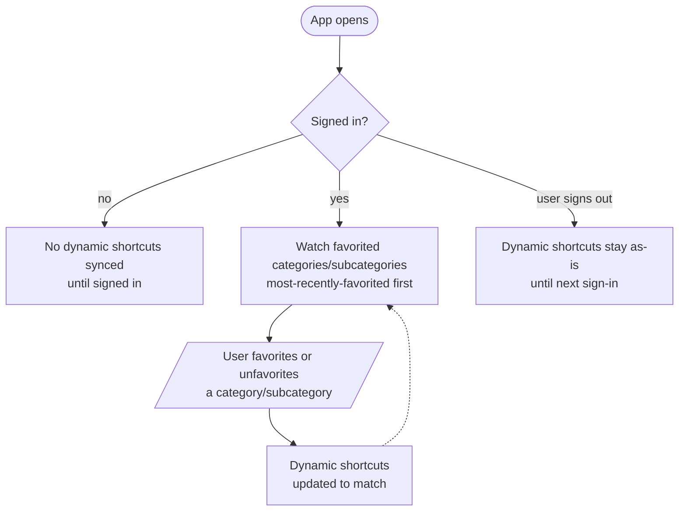
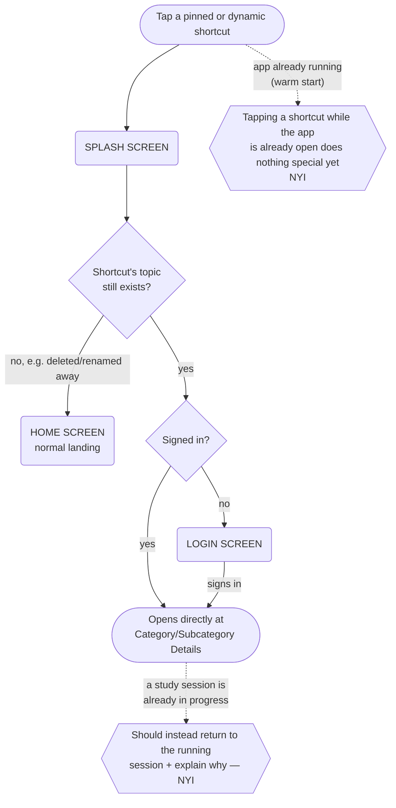

# User Flow — Launcher Shortcuts

Pinning a shortcut, keeping shortcuts in sync with favorites, and opening the app via a shortcut tap. Grilled 2026-09-16 (tickets 01–05 ready-for-agent; two edge cases below are NYI, design pending).

## Pinning a shortcut

## Keeping shortcuts in sync

> Runs continuously in the background while signed in — favoriting or unfavoriting updates the home screen shortcuts without restarting the app.

## Opening the app from a shortcut

